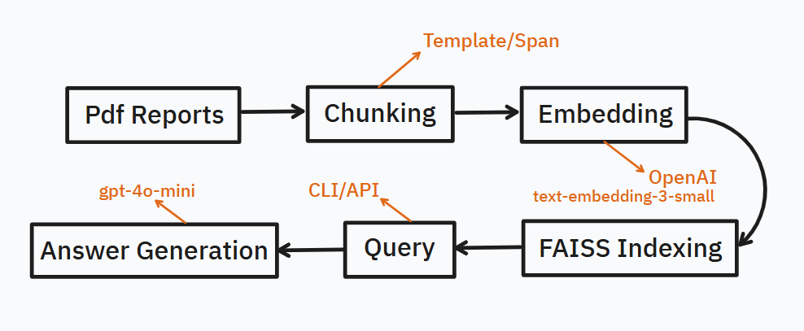

# 🧠 NTTDataRAG

**NTTDataRAG** is an end-to-end Retrieval-Augmented Generation (RAG) pipeline tailored to extract, process, index, and retrieve answers from complex annual PDF reports using OpenAI's embedding and language models.

---

## 🗂 Project Structure

```
├── app.py                    # FastAPI app (RESTful API: /ask, /health)
├── rag_pipeline.py          # Main pipeline (chunk → embed → index → QA)
├── query.py                 # CLI-based interactive Q&A
├── retriever.py             # FAISS indexing logic
├── embedding.py             # OpenAI embedding operations
├── pdf_chunker_*.py         # Custom PDF chunkers by year & layout
├── merge_chunks.py          # Merge multiple .jsonl chunk files
├── utils.py                 # Shared utilities
├── config.py                # Page ranges and coordinates for chunking
├── Dockerfile               # Containerization setup
├── .env                     # OpenAI API Key
├── data/
│   ├── raw/                 # Source PDFs
│   ├── chunks/              # Chunked content (jsonl)
│   ├── merged_chunks.jsonl  # Aggregated chunks for QA
│   ├── embeddings.jsonl     # Embedded vector data
│   └── faiss_index.faiss    # FAISS search index
├── logs/                    # Logs for debugging and QA
└── section_boxes/           # Visual debugging utilities for bounding boxes
```

---

## 🚀 Features

- 📄 **Custom PDF Chunking**: Layout-aware chunking tailored for multi-column business reports
- 🧠 **OpenAI Embeddings**: `text-embedding-3-small` or `text-embedding-3-large` support
- 🔍 **Semantic Search**: FAISS-based vector similarity retrieval
- 💬 **Natural Language QA**: GPT-4o model answering contextually
- 🌐 **API Access**: Query the system via REST with FastAPI
- 🐳 **Dockerized**: Fully containerized for portable deployment

---

## ⚙️ Installation

> Python 3.11+, Poetry is required.

```bash
# Clone and install
git clone https://github.com/anilergan/NTTDataRAG.git
cd nttdatarag

# Install dependencies via Poetry
poetry install

# Create a `.env` file with your OpenAI key
echo "OPENAI_API_KEY=sk-..." > .env
```
---
## 🧱 Manual Chunking Strategy (Before Pipeline)

Before automating the entire pipeline, we implemented manual chunking logic tailored for each PDF structure. Since the layout of NTT Data's PDF reports can vary drastically from year to year, we used **two different chunking strategies** depending on the structural consistency of the document.

---

### 📌 1. Template-Based Chunking

Used for:  
- `sr_2022_cb_v_split.pdf`  
- `sr_2023_cb_v.pdf`  

These PDFs have a **highly regular and repeatable layout**, with each section (e.g., *Social Issues*, *Business Need*, *Solution*, *Impact*) occupying a **fixed and clearly defined area** on the page. Because of this:

- We manually defined section boxes using coordinates in pixels → converted to points.
- These coordinates are stored in `config.py` as `SECTION_COORDINATES_DICT_PDF_2022` and `SECTION_COORDINATES_DICT_PDF_2023`.
- The script `draw_page_section_boxes.py` helps visualize and verify these boxes.
- The chunking logic uses these regions to extract structured data directly.

---

### 📌 2. Span-Based Chunking (Using Text Styling & Layout)

Used for:  
- `sr_2020_cb_p.pdf`  
- `sr_2024_cb_v.pdf`  

These PDFs **lack a rigid structural layout**, but show strong patterns in **text spans** such as font size, font family, position (`BBox`), and color. Therefore:

- We used `pdf_span_analyser.py` to inspect and analyze span-level details for each page.
- Based on patterns (e.g., heading fonts, color = 0, bold sizes), we defined rules to extract `main_title_of_page`, `main_subtitle_of_page`, and each section.
- For 2024: Sections had consistent relative positions (e.g., "Business Need" always below "Social Issues", etc.).
- For 2020: We mainly relied on span color and typography to identify key sections and transitions.

---

### 📊 Supporting Tools

#### ✅ `pdf_span_analyser.py`
Helps inspect spans in a given page and extract metadata like font, color, size, and position.

#### ✅ `draw_page_section_boxes.py`
Used only in template-based PDFs to visually verify the chunk boundaries. Output images are saved as `.jpg` in the `section_boxes/` folder.

Example output:
```
section_boxes/sr_2023_cb_v_page17_sections.jpg
```

---

These manual chunking tools allowed us to build a reliable foundation for downstream embedding, indexing, and retrieval. They are crucial for adapting the pipeline to multiple document formats and layouts.


---

## 📌 Usage

### 1️⃣ Run Full Pipeline (Chunk → Embed → Index → QA Loop)

```bash
poetry run python rag_pipeline.py
```

This will:
- Chunk the PDF (based on `config.py`)
- Generate embeddings and save
- Build FAISS index
- Start interactive CLI Q&A

### 2️⃣ Query via API

```bash
poetry run uvicorn app:app --reload
```

- Go to [http://localhost:8000/docs](http://localhost:8000/docs) for Swagger UI
- Example POST:

```bash
curl -X POST http://localhost:8000/ask \
  -H "Content-Type: application/json" \
  -d '{"question": "What is TradeWaltz and how much efficiency did it provide?"}'
```

### 3️⃣ Build Docker Image

```bash
docker build -t ntt-rag .
```

### 4️⃣ Run in Container

```bash
docker run --env-file .env -p 8000:8000 ntt-rag
```

---

## 🧪 Testing

> (Optional enhancement) Add tests in a `tests/` directory using `pytest`.

```bash
poetry add --dev pytest
poetry run pytest
```

## 📐 Architecture Diagram




## 📚 Sources

This project was developed for a case study on document understanding and retrieval using OpenAI technologies and complex business PDFs from NTT Data.

---

## 🧑‍💻 Author

**Anıl Ergan** – `ergananil@gmail.com`

---

## ✅ License

This repository is licensed for demonstration, academic, and internal review purposes.
